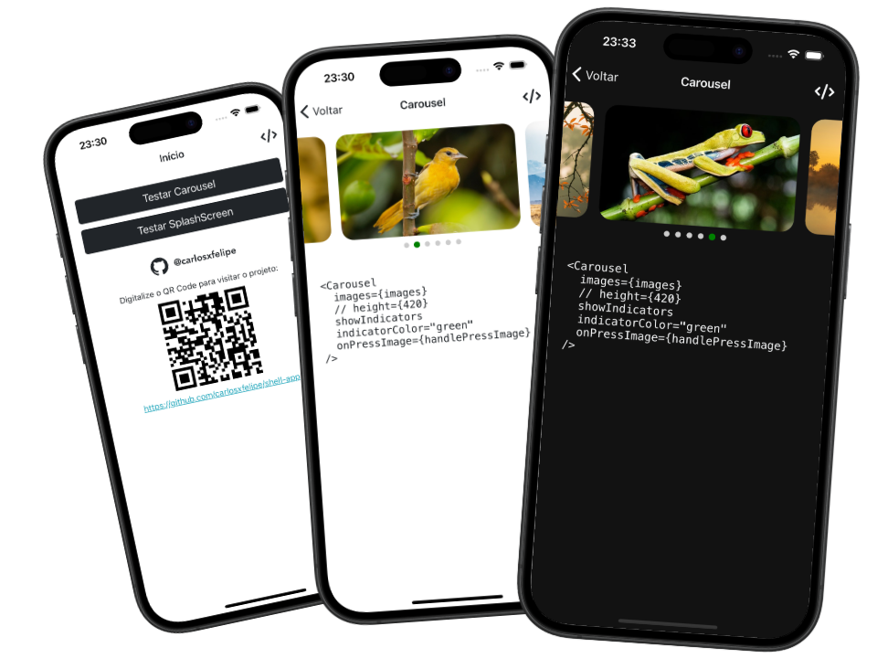

# Shell App

Este é um projeto **React Native CLI** desenvolvido para testar a criação de componentes.

<p align="center">
  
</p>

## Passos para rodar o projeto

1. **Clone o repositório**

   ```bash
   git clone https://github.com/carlosxfelipe/shell-app
   cd shell-app
   ```

2. **Instale as dependências**

   ```bash
   npm install
   ```

3. **Execute o projeto**

   - Para Android:

     ```bash
     npm run android
     ```

   - Para iOS:

   1. Instale as dependências do CocoaPods:

      ```bash
      npx pod-install ios
      ```

   2. Rode o aplicativo:

      ```bash
      npm run ios
      ```

## Licença

Este projeto está licenciado sob a [MIT License](LICENSE). Sinta-se à vontade para usar e modificar o conteúdo conforme necessário.
